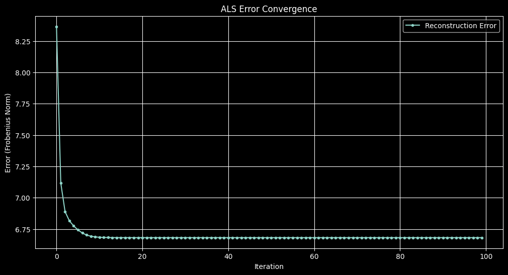

Recommendation systems are algorithms designed to suggest relevant items to users. They're behind many familiar features like Netflix movie recommendations or Amazon product suggestions.

One common approach is _collaborative filtering_, which uses the past behavior of many users to make recommendations. Matrix factorization methods like ALS are powerful techniques for collaborative filtering.

## The Matrix Factorization Problem

In recommendation systems, we typically have:

- A set of users
- A set of items
- A sparse matrix of known ratings or interactions

Let's call this sparse matrix $R$ where $R_{ui}$ represents user $u$'s interaction with item $i$. Most entries in $R$ are missing. 

The basic ALS formulation is particularly useful in **implicit feedback settings**, where zeros are assumed to be meaningful rather than missing data. This approach is commonly used in **implicit recommendation systems**, such as collaborative filtering for user interactions (e.g., clicks, purchases, or views).  
However, in **explicit feedback settings** (e.g., movie ratings), missing values should be properly handled to avoid bias in factorization.

The goal of matrix factorization is to approximate $R$ as the product of two lower-dimensional matrices:

$$ 
R \approx U \cdot V^T 
$$

Where:
$$
\begin{aligned}
& U \text{ is a user-feature matrix of shape } [\text{num\_users}, \text{num\_features}] \\
& V \text{ is an item-feature matrix of shape } [\text{num\_items}, \text{num\_features}]
\end{aligned}
$$


Each row of $ U $ represents a **user’s latent preference vector**, which encodes how much they tend to interact with certain hidden factors. Likewise, each row of $ V $ represents an **item’s latent feature vector**, which captures how strongly an item aligns with those same factors. These vectors are learned such that their interactions best approximate the observed data in $ R $, revealing patterns in user behavior and item similarities.

### **Solving a Non-Convex Optimization Problem**

To reiterate, we aim to approximate $R$ using two lower-rank matrices, capturing the latent structure in the data:

$$
\min_{U, V} \sum_{(u,i) \in \text{observed}} (R_{ui} - U_u V_i^T)^2
$$

This is a **non-convex optimization problem** because both $ U $ and $ V $ are unknown and multiply each other. **Simultaneously** optimizing both matrices would require solving a problem with multiple local minima, making direct gradient-based optimization difficult.

### **Why ALS Works**
Instead of solving for both $ U $ and $ V $ at once, **Alternating Least Squares (ALS)** breaks the problem into two **convex subproblems**:

1. **Fix $ V $ and solve for $ U $**  
2. **Fix $ U $ and solve for $ V $**  

Since each of these steps is a standard **least squares problem**, they have a closed-form solution that can be computed efficiently.


## Setting Up Our Example

Let's create a small example with synthetic data to demonstrate ALS.


```python
import numpy as np
np.set_printoptions(precision=3)
np.random.seed(42)
```


```python
users = 50
items = 30
features = 10
```

The following matrix $R$ represents our sparse user-item interaction matrix. For simplicity, we're using binary values (0 or 1) to indicate whether a user interacted with an item:


```python
R = np.random.choice([0, 1], size= [users,items], p=[.9, .1])
R
```


    array([[0, 1, 0, ..., 0, 0, 0],
           [0, 0, 0, ..., 0, 0, 0],
           [0, 0, 0, ..., 0, 0, 0],
           ...,
           [0, 0, 0, ..., 0, 0, 0],
           [1, 0, 0, ..., 0, 0, 0],
           [0, 0, 0, ..., 0, 0, 0]])


Here we initialize our user and item latent factor matrices with random values from a normal distribution. In a real application, we might use different initialization strategies:


```python
U = np.random.normal(0,1, [users, features])
V = np.random.normal(0,1, [items, features])
```

### **Understanding the ALS Updates**

Matrix factorization assumes we approximate $R$ using two lower-rank matrices $U$ and $V$:

$$
U V^T = R \quad \Leftrightarrow \quad V U^T = R^T
$$

To find optimal values for these matrices, ALS alternates between solving for $U$ with $V$ fixed and vice versa. This alternating approach makes each sub-problem convex, guaranteeing a unique global minimum at each step.

Let's illustrate this clearly by deriving the update rule explicitly for one row of $U$:

- **For each row $U[i]$:**
  
  $$
  U[i] V = R[i]
  $$

  This corresponds to solving the least squares problem[^1]:

  $$
  \min_{U[i]} \sum_{j}\left(R_{ij} - U[i] V[j]^T\right)^2
  $$

  Expanding the squared term gives:

  $$
  \sum_{j}\left(R_{ij}^2 - 2 R_{ij} U[i] V[j]^T + (U[i] V[j]^T)^2\right)
  $$

  Since we fixed $V$, this function is convex in $U[i]$, and the minimum is found by setting the derivative to zero:

  $$
  \sum_j\left(-2 R_{ij} V[j] + 2 U[i] V[j]^T V[j]\right) = 0
  $$

  Simplifying, we have:

  $$
  U[i] \sum_j V[j]^T V[j] = \sum_j R_{ij} V[j]
  $$

  Recognizing the matrix forms:

  $$
  V^T V = \sum_j V[j]^T V[j], \quad V^T R[i] = \sum_j R_{ij} V[j]
  $$

  we obtain the closed-form solution:

  $$
  U[i] = (V^T V)^{-1} V^T R[i]
  $$

- **For each row $V[i]$:**
  
  $$
  V[i] U = R[:, i]
  $$

  Which leads to the least squares update:

  $$
  V[i] = (U^T U)^{-1} U^T R[:, i]
  $$

Now, instead of iterating over rows, these updates can be **vectorized** for efficiency and conciseness:

- **Solving for $U$ in matrix form:**
  
  $$
  U = R V (V^T V)^{-1}
  $$

- **Solving for $V$ in matrix form:**
  
  $$
  V = R^T U (U^T U)^{-1}
  $$

### **Solving the Least Squares System with `numpy.linalg.solve`**  

The least squares updates derived above involve computing matrix inverses. However, explicitly computing the inverse (or pseudoinverse) can be numerically unstable. Instead, we solve the linear system directly using `numpy.linalg.solve`, which finds the solution \( X \) to the equation:

$$
A X = B
$$

where \( A = V^T V \) and \( B = V^T R^T \) (for solving \( U \)), or \( A = U^T U \) and \( B = U^T R \) (for solving \( V \)). 

Thus, the least squares updates can be computed efficiently and with better numerical stability as:

$$
U = \text{np.linalg.solve}(V^T V, V^T R^T)^T
$$

$$
V = \text{np.linalg.solve}(U^T U, U^T R)^T
$$

We will use this formulation in the ALS implementation below.


```python
# Compute initial reconstruction error
prev_score = np.linalg.norm(U @ V.T - R)

# Store errors for visualization
errors = [prev_score]

# ALS Iterations
num_iterations = 100
for iteration in range(num_iterations):
    # Without vectorization (per-row computation)
    # for i in range(U.shape[0]):
    #     U[i] = np.linalg.pinv(V.T @ V) @ V.T @ R[i]

    # Equivalent vectorized forms for solving U:
    # U = (np.linalg.pinv(V.T @ V) @ V.T @ R.T).T
    # U = R @ V @ np.linalg.pinv(V.T @ V)
    U = np.linalg.solve(V.T @ V, V.T @ R.T).T  # numerically stable solution

    # Without vectorization (per-row computation)
    # for i in range(V.shape[0]):
    #     V[i] = np.linalg.pinv(U.T @ U) @ U.T @ R[:, i]

    # Equivalent vectorized forms for solving V:
    # V = (np.linalg.pinv(U.T @ U) @ U.T @ R).T
    # V = R.T @ U @ np.linalg.pinv(U.T @ U)
    V = np.linalg.solve(U.T @ U, U.T @ R).T  # numerically stable solution

    # Compute and store error after each iteration
    errors.append(np.linalg.norm(U @ V.T - R))

# Compute final reconstruction error
final_score = errors[-1]

print(f"Initial error: {errors[0]:.4f}")
print(f"Error after 1 iteration: {errors[1]:.4f}")
print(f"Final error after {num_iterations} iterations: {final_score:.4f}")

```

    Initial error: 120.4196
    Error after 1 iteration: 8.3655
    Final error after 100 iterations: 6.6819


```python
import matplotlib.pyplot as plt
plt.style.use('dark_background')
plt.figure(figsize=(12, 6))
plt.plot(errors[1:], marker="o", linestyle="-", markersize=3, label="Reconstruction Error") # Exclude the first error value to better visualize the convergence process without the initial large drop.
plt.xlabel("Iteration")
plt.ylabel("Error (Frobenius Norm)")
plt.title("ALS Error Convergence")
plt.legend()
plt.grid()
plt.show()

```


    

    


### **Regularized ALS**

In practice, it's common to add regularization terms to ALS to prevent overfitting and improve numerical stability. Regularized ALS optimizes the following loss function:

$$
L = \sum_{m,n}(R_{mn} - U_m^T V_n)^2 + \lambda \sum_m ||U_m||^2 + \lambda \sum_n ||V_n||^2
$$

This leads to the regularized update equations:
  
$$
U = (V^T V + \lambda I)^{-1} V^T R
\quad \text{and} \quad
V = (U^T U + \lambda I)^{-1} U^T R
$$

Regularization is especially valuable when working with sparse datasets, as it helps avoid **singular matrix issues** during matrix inversion steps.


### **Weighted ALS (WALS)**

Weighted ALS generalizes ALS by assigning different importance (weights) to observed ratings. This method is particularly beneficial in explicit feedback scenarios, such as rating systems (e.g., movie ratings), where some items or users have significantly more interactions than others. By applying weights, WALS compensates for this imbalance, boosting underrepresented items and improving recommendation fairness.

WALS optimizes the following loss function:

$$
L^w = \sum_{m,n} w_{mn}(R_{mn} - U_m^T V_n)^2 + \lambda \sum_m ||U_m||^2 + \lambda \sum_n ||V_n||^2
$$

Here, each rating's squared error is scaled individually by a weight \(w_{mn}\).

#### **Choosing the weights**

Inspired by [this resource](https://cs229.stanford.edu/proj2017/final-posters/5147271.pdf)[^2], we propose a practical method for computing these weights, accounting for item popularity:

- Each weight \(w_{mn}\) is computed as a baseline plus a scaling factor dependent on how frequently the item \(n\) has been reviewed:

$$
w_{mn} = w_0 + f(c_n)
$$

- \(w_0\) is a baseline weight, ensuring every interaction has a minimal influence.
- \(c_n = \sum_{m} \mathbf{1}(R_{mn} > 0)\) is the number of non-zero ratings for item \(n\), representing the item's popularity.

Two common choices for the scaling function \(f(c_n)\) are:

- **Linear (explicit) scaling**, suitable for explicit feedback datasets (such as movie ratings):

  $$
  f(c_n) = \frac{w_k}{c_n}
  $$

  Here, more popular items (higher \(c_n\)) receive lower additional weight, balancing their influence.

- **Exponential (implicit) scaling**, suitable for implicit feedback scenarios (such as clicks or views):

  $$
  f(c_n) = \left(\frac{1}{c_n}\right)^e
  $$

  This sharply decreases the influence of very popular items, controlled by the exponent \(e\).

#### **Weighted ALS Update Step**

When performing updates in WALS, the weight vector for each user or item is transformed into a diagonal matrix by multiplying with the identity matrix:

- For user factors \(U_m\):

  $$
  U_m = \left(V^T (\text{diag}(w_m)) V + \lambda I\right)^{-1} V^T (\text{diag}(w_m)) R_m
  $$

- For item factors \(V_n\):

  $$
  V_n = \left(U^T (\text{diag}(w_n)) U + \lambda I\right)^{-1} U^T (\text{diag}(w_n)) R_n
  $$

In these equations, \(\text{diag}(w_m)\) and \(\text{diag}(w_n)\) explicitly create diagonal matrices from weight vectors \(w_m\) and \(w_n\), respectively, ensuring that each interaction is weighted correctly and independently.

A complete, efficient implementation of Weighted ALS using these updates will be provided in the full code example at the end of this blog post.


### **Alternatives and Extra Resources**

While ALS and its weighted variant are effective, other optimization methods like **Stochastic Gradient Descent (SGD)** are frequently employed:

- **Stochastic Gradient Descent (SGD)** updates parameters iteratively, adjusting each user-item interaction individually. This characteristic makes SGD well-suited for **online recommendation systems**, though typically slower for large batch-processed datasets.

Notable resources and advanced readings include:

- ["Fast Matrix Factorization for Online Recommendation with Implicit Feedback"](https://arxiv.org/pdf/1708.05024)[^3], presenting efficient algorithms specifically tailored for implicit-feedback online scenarios.

These alternatives and resources are valuable considerations when adapting matrix factorization methods to diverse real-world scenarios.

## Conclusion

Alternating Least Squares is a powerful technique for matrix factorization in recommendation systems. The algorithm's key advantage is that it handles the non-convex optimization problem by alternating between convex subproblems, each of which has a closed-form solution.

While more advanced techniques like neural collaborative filtering have emerged in recent years, ALS remains relevant for its simplicity, interpretability, and effectiveness, especially for large-scale recommendation tasks.

## Full Python implementations


```python
import numpy as np
np.random.seed(42)

def als_with_regularization(R, num_features=10, num_iterations=100, lambda_reg=0.1):
    users, items = R.shape
    U = np.random.normal(0, 1, (users, num_features))
    V = np.random.normal(0, 1, (items, num_features))

    for _ in range(num_iterations):
        U = np.linalg.solve(V.T @ V + lambda_reg * np.eye(num_features), V.T @ R.T).T
        V = np.linalg.solve(U.T @ U + lambda_reg * np.eye(num_features), U.T @ R).T

    return U, V

users, items, features = 50, 30, 10
R = np.random.choice([0, 1], size=(users, items), p=[0.9, 0.1])

U, V = als_with_regularization(R, num_features=features, num_iterations=100, lambda_reg=0.1)
reconstructed_R = U @ V.T

print(f"Reconstruction Error: {np.linalg.norm(R - reconstructed_R):.4f}")

```

    Reconstruction Error: 6.6894


```python
import numpy as np
np.random.seed(42)

def weighted_als(R, num_features=10, num_iterations=100, lambda_reg=0.1, weight_fn=lambda c_n: 0.1 + 1.0 / (c_n + 1e-8)):
    users, items = R.shape
    U = np.random.normal(0, 1, (users, num_features))
    V = np.random.normal(0, 1, (items, num_features))

    # Item popularity
    c_n = np.sum(R > 0, axis=0)
    weights = weight_fn(c_n)

    for _ in range(num_iterations):
        # Update user factors
        for m in range(users):
            Wm = np.diag(weights * (R[m, :] > 0))
            U[m] = np.linalg.solve(
                V.T @ Wm @ V + lambda_reg * np.eye(num_features),
                V.T @ Wm @ R[m, :]
            )

        # Update item factors
        for n in range(items):
            Wn = np.diag(weights[n] * (R[:, n] > 0))
            V[n] = np.linalg.solve(
                U.T @ Wn @ U + lambda_reg * np.eye(num_features),
                U.T @ Wn @ R[:, n]
            )

    return U, V

# Generate explicit rating matrix (1–5 stars), sparse
users, items = 50, 30
R = np.random.choice([0, 1, 2, 3, 4, 5], size=(users, items), p=[0.7, 0.06, 0.06, 0.06, 0.06, 0.06])
# R = np.random.choice([0, 1], size=(users, items), p=[0.9, 0.1])

# Custom weighting function example (linear)
def linear_weight_fn(c_n, w0=0.1, wk=1.0):
    return w0 + wk / (c_n + 1e-8)

# Run Weighted ALS
U, V = weighted_als(R, num_features=10, num_iterations=100, lambda_reg=0.1, weight_fn=linear_weight_fn)
reconstructed_R = U @ V.T

print(f"Weighted Reconstruction Error: {np.linalg.norm((R - reconstructed_R)*(R>0)):.4f}")
print(f"Weighted Reconstruction Error: {np.linalg.norm((R - reconstructed_R)):.4f}")
```

    Weighted Reconstruction Error: 3.0118
    Weighted Reconstruction Error: 84.2561


# Real-world example


```python
from functools import partial
import numpy as np
import pandas as pd
import time

# ---------------------
# Data loading and preprocessing
# ---------------------
url = "https://files.grouplens.org/datasets/movielens/ml-100k/u.data"
ratings = pd.read_csv(url, sep="\t", names=["user_id", "item_id", "rating", "timestamp"])
ratings["user_id"] -= 1
ratings["item_id"] -= 1

# Sort by timestamp and split train/test (80/20)
ratings_sorted = ratings.sort_values("timestamp").reset_index(drop=True)
split_idx = int(len(ratings_sorted) * 0.8)
train_data, test_data = ratings_sorted[:split_idx], ratings_sorted[split_idx:]

# Drop test users with <10 ratings in train set
user_rating_counts = train_data['user_id'].value_counts()
valid_users = user_rating_counts[user_rating_counts >= 10].index
test_data = test_data[test_data['user_id'].isin(valid_users)]

print(f"Number of users in train set: {len(train_data['user_id'].unique())}; Number of ratings in train set: {len(train_data)}")
print(f"Number of users in test set: {len(test_data['user_id'].unique())}; Number of ratings in test set: {len(test_data)}")

num_users = ratings.user_id.max() + 1
num_items = ratings.item_id.max() + 1

def to_matrix(df):
    R = np.zeros((num_users, num_items))
    for row in df.itertuples():
        R[row.user_id, row.item_id] = row.rating
    return R

R_train = to_matrix(train_data)
R_test = to_matrix(test_data)

# ---------------------
# Weighting and evaluation functions
# ---------------------
def exponential_weight_fn(c_n, w0=0.1, e=0.25):
    return w0 + np.power(1 / (c_n + 1e-8), e)

def linear_weight_fn(c_n, w0=0.1, wk=1.0):
    return w0 + wk / (c_n + 1e-8)

def compute_rmse(R_true, R_pred):
    mask = R_true > 0
    error = np.linalg.norm((R_true - R_pred) * mask) / np.sqrt(mask.sum())
    return error

# ---------------------
# Baseline Models
# ---------------------
# (Assume als_with_regularization and weighted_als are defined elsewhere.)

# ALS with Regularization
start = time.time()
U_reg, V_reg = als_with_regularization(R_train, num_iterations=5, lambda_reg=1.5, num_features=10)
time_reg = time.time() - start

# Weighted ALS (Exponential) with default parameters (w0=1, e=0.1)
start = time.time()
U_wals_exp, V_wals_exp = weighted_als(R_train, num_iterations=5, lambda_reg=1.5,
                                      weight_fn=partial(exponential_weight_fn, w0=1, e=0.1),
                                      num_features=10)
time_wals_exp = time.time() - start

# Weighted ALS (Linear) with default parameters (using the function directly)
start = time.time()
U_wals_lin, V_wals_lin = weighted_als(R_train, num_iterations=5, lambda_reg=1.5,
                                      weight_fn=linear_weight_fn,
                                      num_features=10)
time_wals_lin = time.time() - start

# Global Mean Baseline
global_mean = np.mean(R_train[R_train > 0])
baseline_train_rmse = compute_rmse(R_train, global_mean * np.ones_like(R_train))
baseline_test_rmse = compute_rmse(R_test, global_mean * np.ones_like(R_test))

# Item Bias Baseline
item_sums = np.sum(R_train, axis=0)
item_counts = np.count_nonzero(R_train, axis=0)
item_biases = (item_sums - item_counts * global_mean) / (item_counts + 1e-8)
R_itembias = np.tile(global_mean, (num_users, num_items)) + item_biases
itembias_train_rmse = compute_rmse(R_train, R_itembias)
itembias_test_rmse = compute_rmse(R_test, R_itembias)

methods = [
    "ALS Regularized",
    "Weighted ALS (Exponential)",
    "Weighted ALS (Linear)",
    "Global Mean Baseline",
    "Item Bias Baseline"
]

train_rmse = [
    compute_rmse(R_train, U_reg @ V_reg.T),
    compute_rmse(R_train, U_wals_exp @ V_wals_exp.T),
    compute_rmse(R_train, U_wals_lin @ V_wals_lin.T),
    baseline_train_rmse,
    itembias_train_rmse
]

test_rmse = [
    compute_rmse(R_test, U_reg @ V_reg.T),
    compute_rmse(R_test, U_wals_exp @ V_wals_exp.T),
    compute_rmse(R_test, U_wals_lin @ V_wals_lin.T),
    baseline_test_rmse,
    itembias_test_rmse
]

times = [
    time_reg,
    time_wals_exp,
    time_wals_lin,
    0,  # Global Mean is instantaneous
    0   # Item Bias is also fast
]

results_baselines = pd.DataFrame({
    "Method": methods,
    "Train RMSE": train_rmse,
    "Test RMSE": test_rmse,
    "Time (s)": times
})

print("\n--- Baseline Results ---")
print(results_baselines)

# ---------------------
# Grid Search for Weight Function Tuning
# ---------------------
# Grid search: Exponential Weight Function
exp_results = []
print("\nGrid search: Exponential Weight Function")
for w0 in [0.5, 1.0, 1.5]:
    for e in [0.05, 0.1, 0.2]:
        weight_fn_exp = partial(exponential_weight_fn, w0=w0, e=e)
        start = time.time()
        U_exp, V_exp = weighted_als(R_train, num_iterations=5, lambda_reg=1.5,
                                    weight_fn=weight_fn_exp, num_features=10)
        elapsed = time.time() - start
        test_rmse_exp = compute_rmse(R_test, U_exp @ V_exp.T)
        exp_results.append({
            'w0': w0,
            'e': e,
            'test_rmse': test_rmse_exp,
            'time': elapsed
        })
        print(f"Exp: w0={w0}, e={e}, test RMSE={test_rmse_exp:.4f}, time={elapsed:.2f}s")
        
exp_df = pd.DataFrame(exp_results)
best_exp = exp_df.loc[exp_df['test_rmse'].idxmin()]
print("\nBest Exponential Parameters:")
print(best_exp)

# Grid search: Linear Weight Function
lin_results = []
print("\nGrid search: Linear Weight Function")
for w0 in [0.5, 1.0, 1.5]:
    for wk in [0.05, 0.1, 0.2]:
        weight_fn_lin = partial(linear_weight_fn, w0=w0, wk=wk)
        start = time.time()
        U_lin, V_lin = weighted_als(R_train, num_iterations=5, lambda_reg=1.5,
                                    weight_fn=weight_fn_lin, num_features=10)
        elapsed = time.time() - start
        test_rmse_lin = compute_rmse(R_test, U_lin @ V_lin.T)
        lin_results.append({
            'w0': w0,
            'wk': wk,
            'test_rmse': test_rmse_lin,
            'time': elapsed
        })
        print(f"Lin: w0={w0}, wk={wk}, test RMSE={test_rmse_lin:.4f}, time={elapsed:.2f}s")
        
lin_df = pd.DataFrame(lin_results)
best_lin = lin_df.loc[lin_df['test_rmse'].idxmin()]
print("\nBest Linear Parameters:")
print(best_lin)

```

    Number of users in train set: 751; Number of ratings in train set: 80000
    Number of users in test set: 107; Number of ratings in test set: 2875
    
    --- Baseline Results ---
                           Method  Train RMSE  Test RMSE   Time (s)
    0             ALS Regularized    2.345833   3.170046   0.012091
    1  Weighted ALS (Exponential)    0.711874   1.231554  16.038573
    2       Weighted ALS (Linear)    0.843062   1.228557  14.690037
    3        Global Mean Baseline    1.127381   1.128035   0.000000
    4          Item Bias Baseline    0.995549   1.029807   0.000000
    
    Grid search: Exponential Weight Function
    Exp: w0=0.5, e=0.05, test RMSE=1.2233, time=14.55s
    Exp: w0=0.5, e=0.1, test RMSE=1.2500, time=14.63s
    Exp: w0=0.5, e=0.2, test RMSE=1.2400, time=14.08s
    Exp: w0=1.0, e=0.05, test RMSE=1.2219, time=14.29s
    Exp: w0=1.0, e=0.1, test RMSE=1.2390, time=15.47s
    Exp: w0=1.0, e=0.2, test RMSE=1.2395, time=16.18s
    Exp: w0=1.5, e=0.05, test RMSE=1.3057, time=15.16s
    Exp: w0=1.5, e=0.1, test RMSE=1.2522, time=16.36s
    Exp: w0=1.5, e=0.2, test RMSE=1.2387, time=16.67s
    
    Best Exponential Parameters:
    w0            1.000000
    e             0.050000
    test_rmse     1.221855
    time         14.291877
    Name: 3, dtype: float64
    
    Grid search: Linear Weight Function
    Lin: w0=0.5, wk=0.05, test RMSE=1.2040, time=15.77s
    Lin: w0=0.5, wk=0.1, test RMSE=1.1880, time=15.26s
    Lin: w0=0.5, wk=0.2, test RMSE=1.2058, time=14.41s
    Lin: w0=1.0, wk=0.05, test RMSE=1.2140, time=14.29s
    Lin: w0=1.0, wk=0.1, test RMSE=1.2107, time=14.22s
    Lin: w0=1.0, wk=0.2, test RMSE=1.2290, time=14.79s
    Lin: w0=1.5, wk=0.05, test RMSE=1.2208, time=13.61s
    Lin: w0=1.5, wk=0.1, test RMSE=1.2357, time=13.91s
    Lin: w0=1.5, wk=0.2, test RMSE=1.2590, time=14.17s
    
    Best Linear Parameters:
    w0            0.500000
    wk            0.100000
    test_rmse     1.187972
    time         15.263733
    Name: 1, dtype: float64


# Implicit feedback performance


```python
# Convert ratings into signed preference matrix (+1 or -1)
def to_signed_matrix(df):
    R = np.zeros((num_users, num_items))
    for row in df.itertuples():
        R[row.user_id, row.item_id] = 1 if row.rating >= 4 else -1
    return R

R_train = to_signed_matrix(train_data)
R_test = to_signed_matrix(test_data)

def compute_sign_accuracy(R_true, R_pred):
    mask = R_true != 0
    preds = np.sign(R_pred)  # Convert to +1/-1
    return np.mean((preds[mask] == R_true[mask]).astype(np.float32))

# ALS with Regularization (10 iterations)
start = time.time()
U_reg, V_reg = als_with_regularization(R_train, num_iterations=100, lambda_reg=10, num_features=10)
time_reg = time.time() - start

# Weighted ALS (Exponential Decay, 10 iterations)
start = time.time()
U_wals_exp, V_wals_exp = weighted_als(R_train, num_iterations=10, lambda_reg=10, weight_fn=exponential_weight_fn)
time_wals_exp = time.time() - start

# Weighted ALS (Linear, 10 iterations)
start = time.time()
U_wals_lin, V_wals_lin = weighted_als(R_train, num_iterations=10, lambda_reg=10, weight_fn=linear_weight_fn)
time_wals_lin = time.time() - start

# Global Mean Baseline: predict sign of global mean
global_mean_sign = np.sign(np.mean(R_train[R_train != 0]))
baseline_train_acc = np.mean((R_train[R_train != 0] == global_mean_sign).astype(np.float32))
baseline_test_acc = np.mean((R_test[R_test != 0] == global_mean_sign).astype(np.float32))

# 🔹 Item Bias Baseline: Predict based on item deviation from global mean
global_mean = np.mean(R_train[R_train != 0])  # Compute global mean for signed ratings

item_sums = np.sum(R_train, axis=0)
item_counts = np.count_nonzero(R_train, axis=0)
item_biases = (item_sums - item_counts * global_mean) / (item_counts + 1e-8)  # Avoid division by zero

# Item Bias Predictions
R_itembias = np.tile(global_mean, (num_users, num_items)) + item_biases
R_itembias_signed = np.sign(R_itembias)  # Convert to +1 / -1

# Compute accuracy
itembias_train_acc = compute_sign_accuracy(R_train, R_itembias_signed)
itembias_test_acc = compute_sign_accuracy(R_test, R_itembias_signed)

# Collect results
methods = [
    "ALS Regularized",
    "Weighted ALS (Exponential)",
    "Weighted ALS (Linear)",
    "Global Mean Baseline",
    "Item Bias Baseline"
]

train_acc = [
    compute_sign_accuracy(R_train, U_reg @ V_reg.T),
    compute_sign_accuracy(R_train, U_wals_exp @ V_wals_exp.T),
    compute_sign_accuracy(R_train, U_wals_lin @ V_wals_lin.T),
    baseline_train_acc,
    itembias_train_acc
]

test_acc = [
    compute_sign_accuracy(R_test, U_reg @ V_reg.T),
    compute_sign_accuracy(R_test, U_wals_exp @ V_wals_exp.T),
    compute_sign_accuracy(R_test, U_wals_lin @ V_wals_lin.T),
    baseline_test_acc,
    itembias_test_acc
]

times = [
    time_reg,
    time_wals_exp,
    time_wals_lin,
    0,  # Global Mean is instant
    0   # Item Bias is also fast
]

# Display results
results = pd.DataFrame({
    "Method": methods,
    "Train Accuracy": train_acc,
    "Test Accuracy": test_acc,
    "Time (s)": times
})

print(results)

```

                           Method  Train Accuracy  Test Accuracy   Time (s)
    0             ALS Regularized        0.788575       0.639304   0.125307
    1  Weighted ALS (Exponential)        0.550900       0.528696  28.877307
    2       Weighted ALS (Linear)        0.550900       0.528696  29.041726
    3        Global Mean Baseline        0.550900       0.546087   0.000000
    4          Item Bias Baseline        0.677163       0.670261   0.000000


# Comparing with surprise SVD


```bash
%%bash
uv run --python 3.11 --no-project --with surprise --with "numpy<2" --with "pandas" - <<EOF
from surprise import SVD, Dataset, Reader
from surprise import accuracy
import pandas as pd

# Load MovieLens 100k dataset
url = "https://files.grouplens.org/datasets/movielens/ml-100k/u.data"
ratings = pd.read_csv(url, sep="\t", names=["user_id", "item_id", "rating", "timestamp"])
ratings["user_id"] -= 1
ratings["item_id"] -= 1

# Sort by timestamp (simulate real-world split) and split into train/test
ratings_sorted = ratings.sort_values("timestamp").reset_index(drop=True)
split_idx = int(len(ratings_sorted) * 0.8)
train_data = ratings_sorted[:split_idx]
test_data = ratings_sorted[split_idx:]

# Identify users with >=10 ratings in training set
user_rating_counts = train_data['user_id'].value_counts()
valid_users = user_rating_counts[user_rating_counts >= 10].index

# Keep only valid users in both train and test
train_data = train_data[train_data['user_id'].isin(valid_users)]
test_data = test_data[test_data['user_id'].isin(valid_users)]

# Prepare Surprise-compatible format
surprise_train_data = train_data[["user_id", "item_id", "rating"]]
surprise_test_data = test_data[["user_id", "item_id", "rating"]]

print(f"Train users: {surprise_train_data['user_id'].nunique()}, Ratings: {len(surprise_train_data)}")
print(f"Test users: {surprise_test_data['user_id'].nunique()}, Ratings: {len(surprise_test_data)}")

# Setup Surprise
reader = Reader(rating_scale=(1, 5))
train_dataset = Dataset.load_from_df(surprise_train_data, reader)
trainset = train_dataset.build_full_trainset()
testset = list(surprise_test_data.itertuples(index=False, name=None))

# Train SVD
algo = SVD()
algo.fit(trainset)

# Evaluate
predictions = algo.test(testset)
test_rmse = accuracy.rmse(predictions)
train_rmse = accuracy.rmse(algo.test(trainset.build_testset()))

print("Train RMSE", train_rmse)
print("Test RMSE", test_rmse)
EOF

```

    Train users: 749, Ratings: 79991
    Test users: 107, Ratings: 2875
    RMSE: 0.9820
    RMSE: 0.6756
    Train RMSE 0.6755929602187882
    Test RMSE 0.9820426142365316


```bash
%%bash
uv run --python 3.11 --no-project --with surprise --with "numpy<2" --with "pandas" - <<EOF
from surprise import SVD, Dataset, Reader
from surprise import accuracy
import pandas as pd

# Load MovieLens 100k dataset
url = "https://files.grouplens.org/datasets/movielens/ml-100k/u.data"
ratings = pd.read_csv(url, sep="\t", names=["user_id", "item_id", "rating", "timestamp"])
ratings["user_id"] -= 1
ratings["item_id"] -= 1

# Sort by timestamp and split
ratings_sorted = ratings.sort_values("timestamp").reset_index(drop=True)
split_idx = int(len(ratings_sorted) * 0.8)
train_data = ratings_sorted[:split_idx]
test_data = ratings_sorted[split_idx:]

# Filter to only users with >=10 ratings in the training set
user_rating_counts = train_data['user_id'].value_counts()
valid_users = user_rating_counts[user_rating_counts >= 10].index
train_data = train_data[train_data['user_id'].isin(valid_users)]
test_data = test_data[test_data['user_id'].isin(valid_users)]

# Binarize ratings
train_data = train_data.copy()
test_data = test_data.copy()
train_data["rating"] = train_data["rating"].apply(lambda x: 1 if x >= 4 else -1)
test_data["rating"] = test_data["rating"].apply(lambda x: 1 if x >= 4 else -1)

print(f"Train users: {train_data['user_id'].nunique()}, Ratings: {len(train_data)}")
print(f"Test users: {test_data['user_id'].nunique()}, Ratings: {len(test_data)}")

# Setup surprise
reader = Reader(rating_scale=(-1, 1))  # Because of binarization

# Load into Surprise
train_dataset = Dataset.load_from_df(train_data[["user_id", "item_id", "rating"]], reader)
trainset = train_dataset.build_full_trainset()
testset = list(test_data[["user_id", "item_id", "rating"]].itertuples(index=False, name=None))

# Train SVD
algo = SVD(n_factors=20, n_epochs=20)
algo.fit(trainset)

# Evaluate
predictions = algo.test(testset)

# Accuracy: match sign of predicted vs actual
def compute_sign_accuracy(predictions):
    correct = sum(
        (pred.est >= 0 and pred.r_ui == 1) or (pred.est < 0 and pred.r_ui == -1) 
        for pred in predictions
    )
    return correct / len(predictions)

test_accuracy = compute_sign_accuracy(predictions)
print(f"Test Accuracy: {test_accuracy:.4f}")

# (Optional) Train Accuracy
train_predictions = algo.test(trainset.build_testset())
train_accuracy = compute_sign_accuracy(train_predictions)
print(f"Train Accuracy: {train_accuracy:.4f}")
EOF

```

    Train users: 749, Ratings: 79991
    Test users: 107, Ratings: 2875
    Test Accuracy: 0.6918
    Train Accuracy: 0.7695


# Real-World Conclusion

In a realistic temporal split, **ALS performed well in implicit feedback**, with fast convergence and solid accuracy. On explicit feedback, **Weighted ALS (WALS)** outperformed plain ALS but still failed to beat strong baselines like item bias or Surprise’s SVD. **WALS is also much slower in Python**, due to per-user/item weighted matrix solves. Despite that, ALS remains a strong, efficient choice, especially for large-scale or implicit recommendation tasks.

# References
[^1]: https://mathworld.wolfram.com/NormalEquation.html
[^2]: Stanford CS229 Project. "Weighted Alternating Least Squares." Accessed from: [https://cs229.stanford.edu/proj2017/final-posters/5147271.pdf](https://cs229.stanford.edu/proj2017/final-posters/5147271.pdf)

[^3]: He, Xiangnan, et al. (2017). "Fast Matrix Factorization for Online Recommendation with Implicit Feedback." *Proceedings of SIGIR*. [https://arxiv.org/pdf/1708.05024](https://arxiv.org/pdf/1708.05024)
